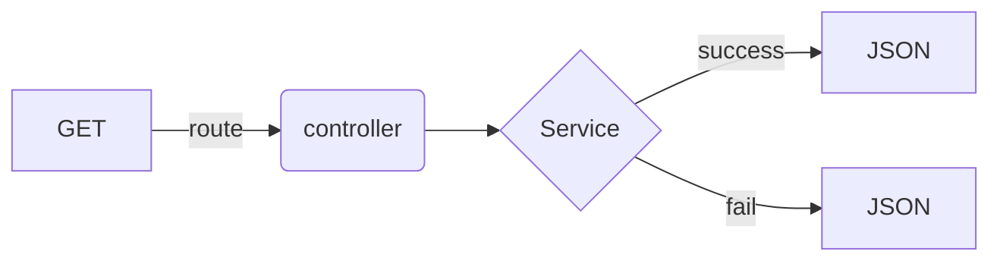
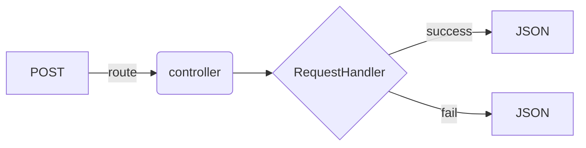
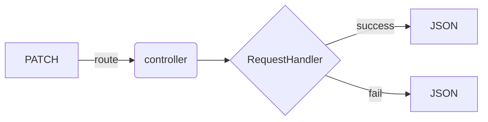
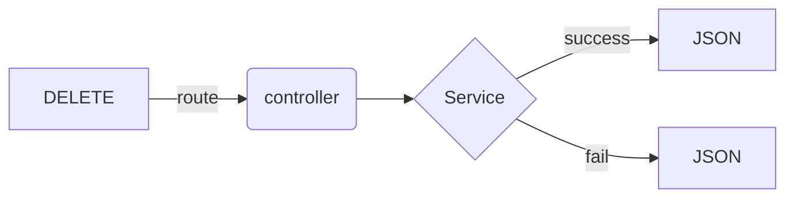

# Start up

### First installation

- Configure your `env.local`
- Start the docker instance `docker-compose up -d`

```bash
// Run the composer install
docker-compose run php-fpm composer install

// create the database tables
docker-compose run php-fpm bin/console doctrine:migration:migrate
```

# LifeCycles

### GET



### POST



### PATCH



### DELETE



# PSALM

```bash
docker-compose run php-fpm ./vendor/bin/psalm
```

# PHP-CS

```bash
docker-compose run php-fpm ./vendor/bin/phpcs ./src
```

# Tests

### Create tests database

```bash
docker-compose run php-fpm bin/console --env=test doctrine:database:create
```

### Create the test tables / columns

```bash
docker-compose run php-fpm bin/console --env=test doctrine:schema:create
```

### Insert Fixtures

```bash
docker-compose run php-fpm bin/console --env=test doctrine:fixtures:load --purge-with-truncate
```

### Run tests

```bash
docker-compose run php-fpm bin/phpunit
```
